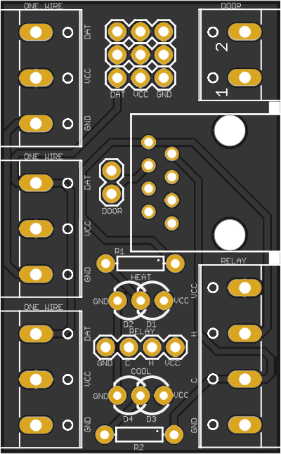
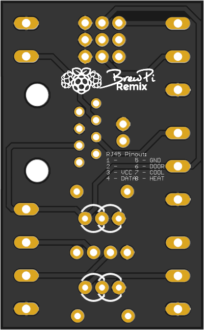

# 
# BrewPi Breakout v1.3.1a

Breakout Board for the [BrewPi Legacy Remix](https://www.brewpiremix.com) project.

This optional breakout board is intended to be connected to the Arduino Shield v1.3.1a via a straight-through RJ45 terminated cable (i.e. an Ethernet cable.)  It allows the Arduino to be located remotely from the fermentation chamber.

 

## Supported Features:

  * Door switch
  * Heat/Cool
    * Dupont pins
    * Screw terminal
  * Heat/Cool LEDs
  * Temp Sensors
    * Three Dupont pin sets
    * Three screw terminals

## Usage Notes:
Since this board is intended to support multiple configurations, some customization during assembly is required.

  - Heat / Cool LEDs - You will use different connections for LEDs depending on the configuration of your actuators.  Connections are provided for two LEDs each for heat and cool, however you will only use one based on your setup
    - Inverted (typical for relay board) - Connect the LED between VCC and the center pin.  A resistor is not needed as there is one on the board
    - Non-Inverted (typical for SSRs) - Connect the LED between the center pin and GND.  A resistor is not needed as there is one on the board

## BOM:

  * 1 ea [Red 3mm LED](https://www.mouser.com/ProductDetail/638-MV5064.MP4B)
  * 1 ea [Blue 3mm LED](https://www.mouser.com/ProductDetail/941-C503BBCNCV0Z0461)
  * 2 ea [220Ω 1/4W Axial Resistors](https://www.mouser.com/ProductDetail/660-MF1-4DCT52R2200F)
  * 1 ea 4-Pin header
  * 1 ea 2-Pin header
  * 3 ea 3-Pin headers
  * 1 ea RJ45 terminal
  * 3 ea 3-Position screw terminal
  * 1 ea 4-Position screw terminal
  * 1 ea 2-Position screw terminal

## Board Manufacture
You may order this board for manufacture directly from [OshPark](https://oshpark.com/shared_projects/SfXfFd61).

## Modifying These Files
If you would like to personalize these board designs, you may modify them with [Autodesk's EAGLE](https://www.autodesk.com/products/eagle/overview). EAGLE is a scriptable electronic design automation (EDA) application with schematic capture, printed circuit board (PCB) layout, auto-router and computer-aided manufacturing (CAM) features. EAGLE stands for Easily Applicable Graphical Layout Editor and is developed by CadSoft Computer GmbH. The company was acquired by Autodesk Inc. in 2016.  

The program supports Windows, Linux, and Mac OS X.  EAGLE is available in a [free version](https://www.autodesk.com/products/eagle/free-download), as well as a [subscription-based version with more features](https://www.autodesk.com/products/eagle/compare).
