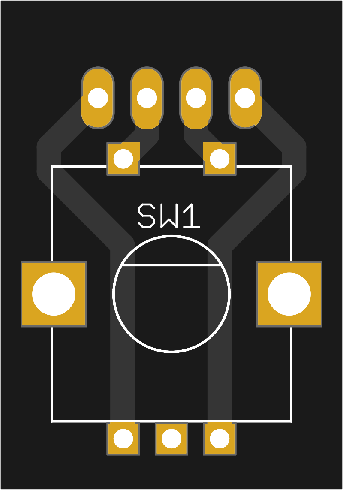
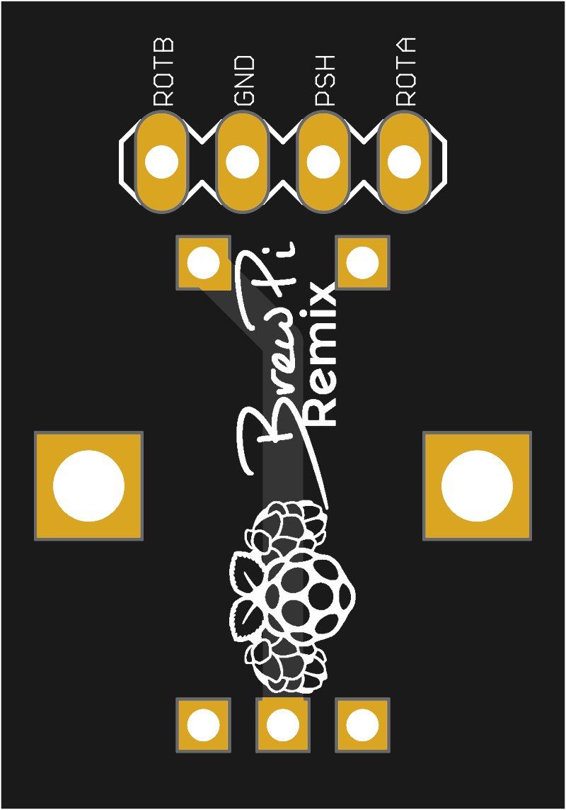

# 
# Rotary Encoder Breakout v1.3.1a

A breakout board to provide pins for connecting the rotary encoder to the BrewPi controller.  Designed for CUI, [ACZ11BR1E-15FD1-20C](https://www.mouser.com/ProductDetail/490-CZ11BR1E15FD120C) or similar footprint.  Despite the picture linked on that page, you want a vertical mounting encoder (and that one really is.)  You don't really *need* this, but it will surely make it easier to connect things with Dupont wires.

 

## BOM:

  * 1 each [Four-pin 2.54mm Dupont header](https://www.mouser.com/ProductDetail/3M-Electronic-Solutions-Division/2306-6111-TG?qs=%2Fha2pyFadugRJwJpPlsc93EQbgCw2BZBGXZU41%252B3vFuJqgOFSmLjZA%3D%3D), male or female according to your preference.
  * 1 each CUI [Rotary Encoder ACZ11BR1E-15FD1-20C](https://www.mouser.com/ProductDetail/490-CZ11BR1E15FD120C)  - You want a magnetic encoder with a vertical shaft, no pull-ups, and 20 detents
  * 1 each [Rotary Knob](https://www.mouser.com/ProductDetail/450-4763)

## Board Manufacture
You may order this board for manufacture directly from [OshPark](https://oshpark.com/shared_projects/IlNFHwwH).

## Modifying These Files
If you would like to personalize these board designs, you may modify them with [Autodesk's EAGLE](https://www.autodesk.com/products/eagle/overview). EAGLE is a scriptable electronic design automation (EDA) application with schematic capture, printed circuit board (PCB) layout, auto-router and computer-aided manufacturing (CAM) features. EAGLE stands for Easily Applicable Graphical Layout Editor and is developed by CadSoft Computer GmbH. The company was acquired by Autodesk Inc. in 2016.  

The program supports Windows, Linux, and Mac OS X.  EAGLE is available in a [free version](https://www.autodesk.com/products/eagle/free-download), as well as a [subscription-based version with more features](https://www.autodesk.com/products/eagle/compare).
