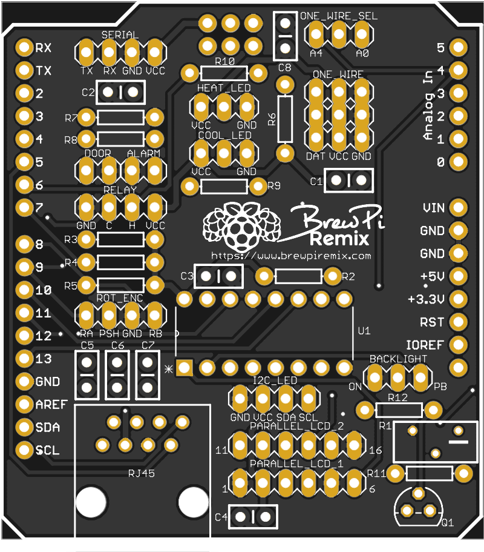
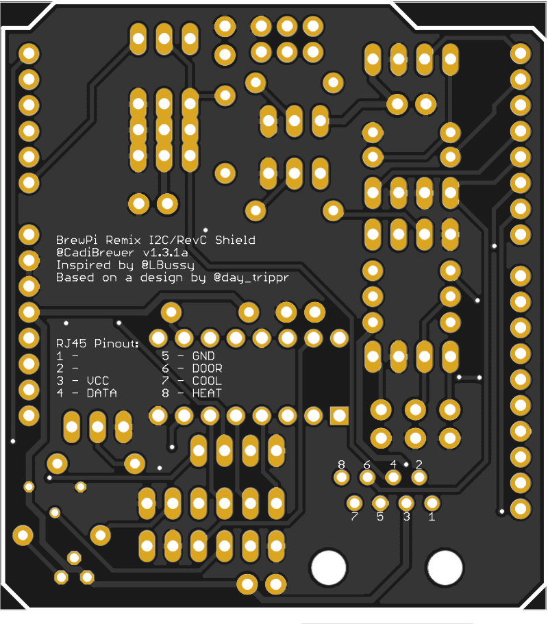

# 
# BrewPi Arduino Uno Shield v1.3.1a (I2C/Parallel LCD)

Arduino Uno shield for the [BrewPi Remix](https://www.brewpiremix.com) project.

This is an new board design which incorporates an I2C LCD header in addition to the original parallel LCD header on the RevC.  The I2C display is supported in version 0.5.3 of BrewPi Legacy Remix Scripts, WWW and Tools, coupled with version 0.2.12 of the Arduino Firmware.

 

## Supported Features:

  * Wireless to Serial Bridge (Bluetooth or ESP8266 module)
  * Door switch
  * Alarm
  * Heat/Cool Relay
  * Rotary Encoder w/Pushbutton
  * Heat/Cool LEDs
  * OneWire Selector A0/A4 (required for I2C)
  * Three OneWire connections
  * I2C LCD; or;
  * Parallel LCD
  * RJ45 connector includes support for:
    * OneWire
    * Door Switch
    * Heat/Cool Relay
  * All Arduino headers available

## Usage Notes:
Since this board is intended to support both the RevC as well as the I2C firmware, some configuration is required via jumper caps.

  - ONE_WIRE_SEL Jumper - If you do not select the proper configuration, you may not be able to configure the OneWire sensors, the display may fault, or both.
    - Jump between A4 and the center pin for RevC
    - Jump between A0 and the center pin for I2C
  - Backlight Timeout - If you do not have a rotary encoder you will not be able to wake the backlight if it times out.  You can configure the board to never turn off the backlight
    - RevC - The BACKLIGHT jumper has two settings:
      - Jump between ON and the center pin to have the backlight stay on
      - Jump between PB and the center pin to have the backlight time out
    - I2C - The backlight setting uses the rotary encoder header
      - If you have a rotary encoder, pushing the button during a controller reset will disable backlight timer
      - If you do not have a rotary encoder, adding a jumper on the ROT_ENC header between PSH and GND will disable backlight timer
  - Heat / Cool LEDs - You will use different connections for LEDs depending on the configuration of your actuators
    - Inverted (typical for relay board) - Connect the LED between VCC and the center pin.  A resistor is not needed as there is one on the board
    - Non-Inverted (typical for SSRs) - Connect the LED between the center pin and GND.  A resistor is not needed as there is one on the board

## BOM:

  * From Mouser (by using [this link](https://www.mouser.com/ProjectManager/ProjectDetail.aspx?AccessID=d74098d8b5) you can view all of these parts on Mouser and simply click the "Order Project" button):
    * 7 ea [0.1μF Ceramic Capacitor](https://www.mouser.com/ProductDetail/?qs=PmkNt%2FFLxQc4kNUCHU6a6Q%3D%3D) (C1-7)
    * 1 ea [1.0μF Ceramic Capacitor](https://www.mouser.com/ProductDetail/?qs=AQlKX63v8RtdX%2FUKFBhcig%3D%3D) (C8)
    * 1 ea [10kΩ Trimmer Resistor](https://www.mouser.com/ProductDetail/?qs=V3Em1enZyNPGF2%252BnCaKTKw%3D%3D) (R1)
    * 4 ea [10kΩ Axial Resistor 1/4W](https://www.mouser.com/ProductDetail/?qs=AtFvwFU%2F1FmCMXRebRRiVA%3D%3D) (R3-5, 12)
    * 1 ea [150Ω Axial Resistor 1/4W](https://www.mouser.com/ProductDetail/?qs=7jyBjEprRBipjkz1NPmruA%3D%3D) (R11)
    * 1 ea [1kΩ Axial Resistor 1/4W](https://www.mouser.com/ProductDetail/?qs=ddCg%252BR5cWn2sqOoxwN8P1g%3D%3D) (R8)
    * 1 ea [20kΩ Axial Resistor 1/4W](https://www.mouser.com/ProductDetail/KOA-Speer/MF1-4CC2002F?qs=sGAEpiMZZMu61qfTUdNhG%2Fir46E4ZSr2LQlauiwvExA%3D) (R2)
    * 2 ea [220Ω Axial Resistor 1/4W](https://www.mouser.com/ProductDetail/?qs=KVzGhl%2FcVV1aGF8Vc%2F%252BvDg%3D%3D) (R9, 10)
    * 1 ea [2kΩ Axial Resistor 1/4W](https://www.mouser.com/ProductDetail/?qs=iPPgFPFs9PM72iUDc08rBg%3D%3D) (R7)
    * 1 ea [4.7kΩ Axial Resistor 1/4W](https://www.mouser.com/ProductDetail/?qs=WbbykRgge7o4TK6QsdXS5A%3D%3D) (R6)
    * 1 ea [2N3906 PNP Transistor](https://www.mouser.com/ProductDetail/?qs=iN0KuJO79Kbn9o7a2lB4uA%3D%3D)
    * 1 ea [SN74HC595N 8-Bit Shift Register](https://www.mouser.com/ProductDetail/?qs=IEl3ej0IqwBTHkYa8XPoMQ%3D%3D)
    * 1 ea [16-pin IC Socket](https://www.mouser.com/ProductDetail/?qs=5aG0NVq1C4zi9nx%252BGroISQ%3D%3D)
  * From Adafruit:
    * [Shield stacking headers for Arduino](https://www.adafruit.com/product/85)
    * [Break-away 0.1" 36-pin strip male header - Black - 10 pack](https://www.adafruit.com/product/392), more than enough for:
      * 2 ea 2-pin Header 2.54mm pitch (or 1 ea 4 pin)
      * 7 ea 3-pin Header 2.54mm pitch
      * 4 ea 4-pin Header 2.54mm pitch
      * 2 ea 6-pin Header 2.54mm pitch
  * 2 ea [Jumper Cap](https://www.amazon.com/ZYAMY-2-54mm-Standard-Circuit-Connection/dp/B077957RN7) (or you can use a female/female Dupont jumpers but caps are definitely better looking)
  * 1 ea [RJ45 Socket](https://www.aliexpress.com/item/High-Quality-20pcs-RJ45-8P8C-Computer-Internet-Network-PCB-Jack-Socket-Black/32736146888.html)

Other items you may want in order to complete your project:

  * LCD Display, either;
    * [20x4 LCD Parallel](https://www.amazon.com/SunFounder-Serial-Module-Arduino-Mega2560/dp/B071W8SW9R), or;
    * [20x4 LCD I2C](https://www.amazon.com/SunFounder-Serial-Module-Arduino-Mega2560/dp/B01GPUMP9C)
  * [5v 2-Channel Relay Module](https://www.amazon.com/gp/product/B00TMFVVG6)
  * [Rotary Encoder](https://www.mouser.com/ProductDetail/490-CZ11BR1E15FD120C)  - You want a magnetic encoder, no pull-ups, and 20 detents
  * [Knob for Rotary Encoder](https://www.mouser.com/ProductDetail/Eagle-Plastic-Devices/450-4763?qs=sGAEpiMZZMuiwDVLTMm01an1wsjHLopM%252Bn33k8wqz%252Bs%3D)
  * [Rotary Encoder Breakout Board](https://PCBs.io/share/zkPZ0)
  * At least two [DS18B20 Waterproof Temperature Sensors](https://www.amazon.com/gp/product/B01JKVRVNI)
  * Assorted [Dupont Jumper Wires](https://www.amazon.com/Multicolored-Breadboard-Dupont-Jumper-Wires/dp/B073X7P6N2) (male-male, male-female, female-female)

## Board Manufacture
You may order this board for manufacture directly from [pcbs.io](https://PCBs.io/share/zdeBw).

## Modifying These Files
If you would like to personalize these board designs, you may modify them with [Autodesk's EAGLE](https://www.autodesk.com/products/eagle/overview). EAGLE is a scriptable electronic design automation (EDA) application with schematic capture, printed circuit board (PCB) layout, auto-router and computer-aided manufacturing (CAM) features. EAGLE stands for Easily Applicable Graphical Layout Editor and is developed by CadSoft Computer GmbH. The company was acquired by Autodesk Inc. in 2016.  

The program supports Windows, Linux, and Mac OS X.  EAGLE is available in a [free version](https://www.autodesk.com/products/eagle/free-download), as well as a [subscription-based version with more features](https://www.autodesk.com/products/eagle/compare).
